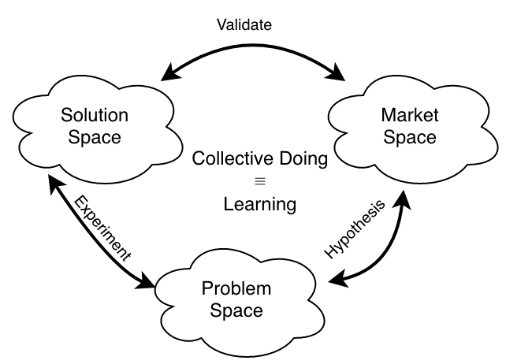
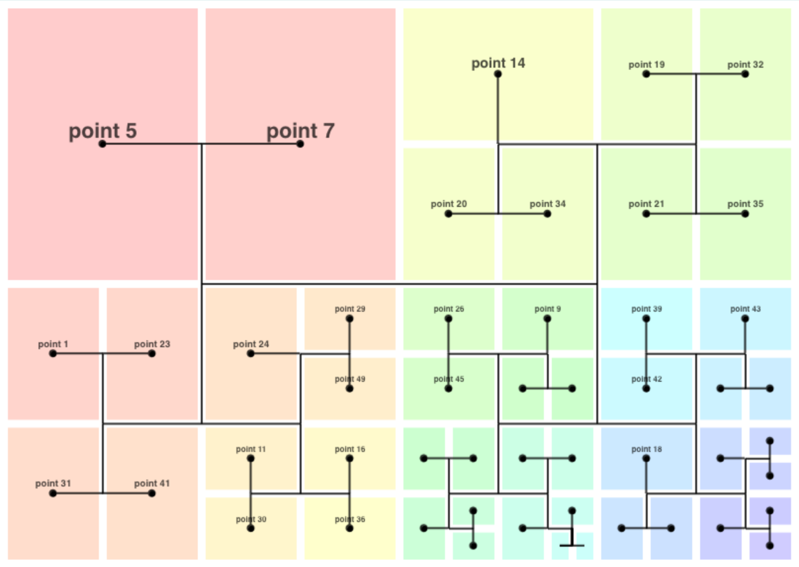
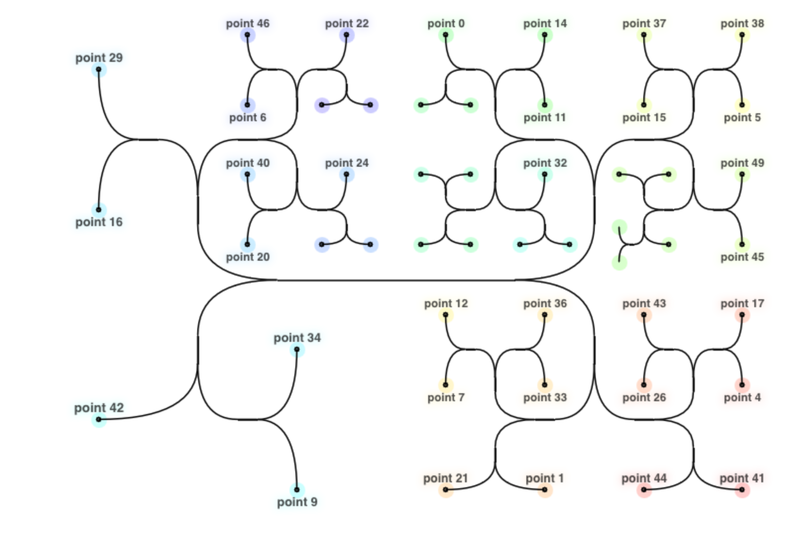

# Understanding Platforms

### What They Are, Why They Work, When to Use Them, How to Build Them

<!-- _class: dark -->

<!-- footer: Hazel Weakly (@hazelweakly@hachyderm.io) -->

# Agenda

<!-- header: Understanding Platforms: What They Are, Why They Work, When to Use Them, How to Build Them -->

[[toc]]

# What is Doing?

<!-- _class: dark -->

<!-- header: What is Doing? -->

---

<h2>

$$
\text{\bf{Motivation}} + \text{\bf{Relationship}} + \text{\bf{Context}} = \text{\bf{Action}}
$$

</h2>

IC
: Systems engineering through technical work

Manager
: Systems engineering through people work

Exec
: Systems engineering through systems work

## How Do We Do?

One of the main hurdles when building a company is figuring out how to scale decision making

---

{.mia}

---

<h2>

$$ \xcancel{\text{Productivity}}\ \text{\bf{Motivation}} + \text{Relationship} + \text{Context} = \text{Action} $$

</h2>

| IC       | Manager  | Exec      |
| -------- | -------- | --------- |
| Thriving | Outcomes | Alignment |

---

<h2>

$$ \text{Motivation} + \text{\bf{Relationship}} + \text{Context} = \text{Action} $$

</h2>

Relationships change fundamentally based on their scope

| 1    | 3-5   | 15       | 50                          | 150                                    | ... |
| ---- | ----- | -------- | --------------------------- | -------------------------------------- | --- |
| self | group | 3 groups | $3\times(3\ \text{groups})$ | $3 \times (3\times(3\ \text{groups}))$ | ... |

Every combination is a different relationship and collaborates differently.

<!-- prettier-ignore -->
* The effectiveness of a collaboration model is influenced by the scope, the context, and the motivation under which it's utilized.
* Ideal collaboration happens when the ownership of the work, the motivation to do it, and the authority to complete it are all mutually aligned.
* There's another set of factors here: Time, and Stability.
  [(They're less relevant than you'd think)]{.text-2}
* We think of Time as teams having a life-cycle, but that's not really true in the traditional "Forming, Norming, Storming, Dying" sense.
* We like stability because it's an effective compensation mechanism for working around bad management, poor alignment, lack of agency, overload, and context switching.

---

<h2>

$$ \text{Motivation} + \text{Relationship} + \text{\bf{Context}} = \text{Action} $$

</h2>

{.mia .fragmented}

<!-- prettier-ignore -->
* 

  

  ### Vertical

  - Specialized Knowledge
  - Effective action in the organization
  - Cognitive overhead required for doing
  - Utilizes consensus

  

  

  ### Horizontal

  - Collective Knowledge
  - Effective learning in the organization
  - Cognitive overhead required for collaboration
  - Utilizes alignment

  

  

## Scaling Decision Making

1. Shape motivation
2. Understand relationships
3. Scope context
   {.fragmented}

<!-- prettier-ignore -->
* Building a stable base of knowledge is how you scale collective learning as a society
* ~~Ignorance~~ Limited Context is a feature, not a bug

---

<h2>

$$
\text{\bf{Motivation}} + \text{\bf{Relationship}} + \text{\bf{Context}} = \text{\bf{Action}}
$$

</h2>

IC
: Systems engineering through technical work

Manager
: Systems engineering through people work

Exec
: Systems engineering through systems work

# What is a Platform?

<!-- _class: dark -->

<!-- header: What is a Platform? -->

## Platforms Are a Way to Scale Doing

## What is a Platform?

IC
: Platforms are the Dual of Libraries

Manager
: Platforms turn Service Teams into Product Teams

Exec
: Platforms derisk diversification by exploiting the economics of agglomeration

## Totes Platforms™

- Kubernetes
- Design Systems
- Programs
- Education Curriculum
- Corn
- Sales Funnel
- Jazz Standards
- Mission, Strategy, Vision, Objectives
- Executive Alignment
- Policy
- Language
- APIs
- ISO Standards
- Algebraic Structures Equivalent to Computational Models
  [regex is a platform. die mad about it.]{.text-2}

{.cols .leading-tight}

## Platforms Are Not

These are tools and a means to an end

- Platforms
- DevOps
- Kubernetes
- Libraries
- Process
- Culture
- Infrastructure
- Golden Paths
- SDKs
- Self-Service Platforms
- Cookbooks
- Enabling / Platform Teams

{.cols .leading-tight}

## Platforms ≠ Platform Engineering

<!-- platform engineer and platform engineering are unrelated much like SRE and resilience engineering -->

## Libraries vs Platforms

### Libraries

- Representation of domain knowledge
- Abstracts over implementation
- Interfaced with via process
- Codifies semantics
- Multiplier for platforms

### Platforms

- Representation of knowledge application
- Abstracts over integration
- Interfaced with via policy
- Codifies workflow
- Enables library creation

## Platforms Turn Services into Products

This isn't always good.

It's not always what you want.

You will always need both services and products.

## Platform Synergy

IC
: Libraries are the building blocks of Platforms

Manager
: Platforms synergize with executive alignment _and_ team dynamics

Exec
: Platforms operationalize Libraries the way Programs operationalize Policy
{.text-3}

## DevOps vs SRE vs Platform Engineering

---

DevOps
: A culture of whole-system ownership motivated by broadening horizontal context

SRE
: A specialist role in resilience engineering that naturally arises when horizontal context becomes too large for any one team

Platform Engineering
: An empathy-driven approach towards sociotechnical organizational design

## What is a Platform?

IC
: Platforms are the Dual of Libraries

Manager
: Platforms turn Service Teams into Product Teams

Exec
: Platforms derisk diversification by exploiting the economics of agglomeration

# What Makes Platforms Work?

<!-- _class: dark -->

<!-- header: What Makes Platforms Work? -->

## What Makes Platforms Work?

IC
: Abstractions that are force multipliers

Manager
: Interfaces between teams that reduce cognitive overhead

Exec
: Consistent language and mental models that enable aligned innovation

## Mapping Organizational Structures to Doing

<h3>

$$ \text{Motivation} + \text{Relationship} + \text{Context} = \text{Action} $$

</h3>

## Slicing Context - Functional

{.mia .h-75}

## Slicing Context - Product

{.mia .h-75}

## Slicing Context - Matrix

{.mia .h-75}

## Directional Context

### Vertical

- Specialized Knowledge
- Effective action in the organization
- Cognitive overhead required for doing
- Utilizes consensus

### Horizontal

- Collective Knowledge
- Effective learning in the organization
- Cognitive overhead required for collaboration
- Utilizes alignment

## Context + Collaboration

|                | Vertical ctx size | Horizontal ctx size | Collaboration Complexity | Market Agility |
| -------------- | ----------------- | ------------------- | ------------------------ | -------------- |
| **Functional** | high              | low                 | low                      | low            |
| **Product**    | moderate          | moderate            | moderate                 | moderate       |
| **Matrix**     | high              | high                | high                     | high           |

## Cheating the Matrix

If you "aren't" a matrix organization, but...

- You have teams that rotate projects
- "Dynamic" or "rotating" teams are a thing
- You keep "shifting left" everything
- You compulsively CC 5+ people on every email

You may be entitled to financial compensation

[Call H. E. Weakly (877 RE-ORG)]{.text-2}

<!-- prettier-ignore -->
* Building a stable base of knowledge is how you scale collective learning as a society

  But, how do you build a base of knowledge if scaling requires managing context?
* {.mia .h-100}

## Shrinking Context

IC
: Well designed abstractions

Manager
: Thoughtful interfaces between teams

Exec
: Consistent language and mental models
{.fragmented}

<!-- prettier-ignore -->
* Well designed abstractions are both transparent and opaque
* Thoughtful interfaces between teams result in effective collaboration models
* Humans chunk concepts together to build on top of them

  Providing consistent language and mental models allows people to build their own chunks in a way that results in aligned growth of understanding

## Properties of Good Platforms

- Reduce horizontal context
- Enable emergent innovation
- Enable experimentation
- Minimize migration cost
- Minimize collaboration model overhead
- Improve feedback loops
- Minimize context switching
- Reduce IC context overhead
  {.cols}

## What Makes Platforms Work

IC
: Abstractions that are force multipliers

Manager
: Interfaces between teams that reduce cognitive overhead

Exec
: Consistent language and mental models that enable aligned innovation

# When to Platform

<!-- _class: dark -->

<!-- header: When to Platform? -->

## My Sincere Apologies to Finance Teams and MBAs

## Economics ⇔ Technology {.text-5}

| Economics              | Technology              |
| ---------------------- | ----------------------- |
| _Scarcity Economy_     | _Post-Scarcity Economy_ |
| Fiat currency          | Social currency         |
| Market pressure        | Consensus               |
| Markets                | Tech Stacks, Codebases  |
| Fiscal Debt, Inflation | Tech Debt               |
| Economies              | SDLC, DevEx             |
| Context                | Cognitive Overhead      |

{.text-2}

## Economic Model - Functional

- Economics of scale
- Tech Vertical - often viewed as a cost center
- Value generation comes from removing waste from feedback loop

## Economic Model - Product

- Economics of scope
- Tech Vertical - often viewed as a profit center
- Value generation comes from reuse of overhead when diversifying

## Economic Model - Matrix

- Economics of density
- Often viewed as ~~too much paperwork~~ multiple centers
- Value generation comes from efficiencies generated by peer proximity

## Continuity, Economics

|                | Economy | Growth Strategy     | Continuity | Risk     | Market Agility |
| -------------- | ------- | ------------------- | ---------- | -------- | -------------- |
| **Functional** | Scale   | Market Development  | low        | low      | low            |
| **Product**    | Scope   | Product Development | high       | moderate | moderate       |
| **Matrix**     | Density | Diversification     | moderate   | high     | high           |

{.text-2}

## Platform Economics

{.mia .h-75}

- Libraries mature market development
- Platforms mature product development

<!-- prettier-ignore -->
* 

  {.mia .h-75}

  Platform Engineering derisks effective diversification

  

* 

  {.mia .h-75}

  - Blocks can be seen as services
  - Groups of blocks can be seen as product offerings
  - Clusters are economic optimization opportunities
  - Nodes are teams

  

* 

  {.mia .h-75}

  - Branches can be seen as codebases
  - Branch clusters can be seen as problem domain understanding
  - Clusters are economic optimization opportunities
  - Nodes are teams

  

## When to Platform?

Platforms make sense when the benefits of reducing horizontal context more than offset the overhead of adding a vertical to the organization.

$$
\displaylines{\text{\# verticals in platform's scope} \\ \times \\
((\text{Emergent Innovation} + \text{Context Reduction}) - (\text{Collab Overhead} + \text{Migration Cost}))}
$$

## Platforms must be more than the sum of their parts

# How to Build High-Impact Platforms

<!-- _class: dark -->

<!-- header: How to Build High-Impact Platforms -->

## The Blueprint: LOVE

1. Listen
2. Observe
3. Validate
4. Empathize

## Not the Blueprint: EVIL

1. Examine
2. Vindicate
3. Implement
4. Launch

## Love vs Evil

They're surprisingly similar, really

### Love

1. Listen
2. Observe
3. Validate
4. Empathize

### Evil

1. Examine
2. Vindicate
3. Implement
4. Launch

## Empathy

Perspective taking
: Recognize other people's perspectives as their truth

Staying out of judgement
: Suspend judgement and be curious

Recognizing emotion in other people
: Recognize and acknowledge other people's emotions

Communicating emotion
: Communicate your understanding of other people's emotions
{.text-3}

## Step-By-Step Recipe

Agglomeration-based development

1. Ask people where the pain clusters are
2. Find the pain clusters
3. Compare results
4. Solve the most painful cluster

<!-- prettier-ignore -->
* ### IC
  1. Ask individuals on your team what their pain points are
  2. Look for duplication of effort, code, process, communication
  3. Compare results
* ### EM
  1. Ask teams you interface with what their pain points are
  2. Look for duplication of workflows, interfaces, process, planning
  3. Compare results
* ### Exec
  1. Ask organizational leaders what their pain points are
  2. Look for duplications of language, vision, alignment efforts, programs
  3. Compare results

## Understanding Each Other

### Motivation

IC
: Thriving

Manager
: Outcomes

Exec
: Alignment

<!-- prettier-ignore -->
* ### Priorities

  IC
  : Reduction of toil

  Manager
  : Optimization of team interactions

  Exec
  : Long term alignment of innovation

# Takeaways

<!-- _class: dark -->

<!-- header: Takeaways -->

## A Platform Is An Abstraction That Platforms Like A Platform

## Platform teams are organizationally empowered to address cross-cutting changes

With a combination of technical, procedural, and cultural improvements

## Platform Engineering can turn culture into an intuition around how to use a platform

## Make Change Easy to Handle, Not Easy To Do

## Failure Modes

<!-- prettier-ignore -->
* DevOps tends to fail because the sharp and blunt ends of a system are rarely aligned and addressing that requires a cultural shift
* SRE tends to fail when implemented prematurely; it only makes sense when the horizontal context is too large for any one team
* Platform Engineering tends to fail when implemented without empathy and diversity
* Platform Engineering tends to fail when an agglomeration based approach isn't used to address optimizations

## Platforms are a way to scale doing

## What is Platform Engineering

IC
: Empathy Driven Development

Manager
: Empathy Driven Collaboration

Exec
: Empathy Driven Organizational Design

## Platform Engineering is Empathy Driven Learning
